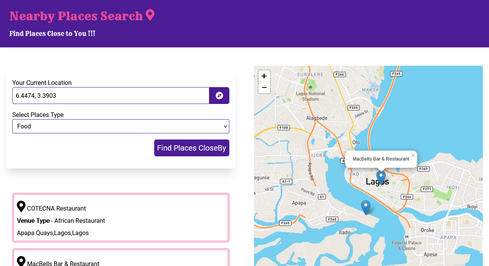

<p align='center'>  </p>

# Nearby Places Search



# Outline


- [About](https://github.com/Abiola-Farounbi/Nearby-Places/#About) 
- [Technologies](https://github.com/Abiola-Farounbi/Nearby-Places/#Technologies)
- [Demo](https://github.com/Abiola-Farounbi/Nearby-Places/#Demo) 
- [Author](https://github.com/Abiola-Farounbi/Nearby-Places/#Author) 


# About

This application provides users with a platform to find places near their location 
 
 ### Features
 - Users are able to search for places close their location. 
 - Users are able to find places(restaurant, transport etc) close their location.
 - Users are able to locate places on the Map.

# Technologies


# Demo
Live site - https://nearbyplacesfinder.netlify.app/

### Setup On Local Server
 
 ```
npm install
```

```
npm run serve
```

# Author 
- [Abiola Farounbi](https://abiolaesther.me/)


